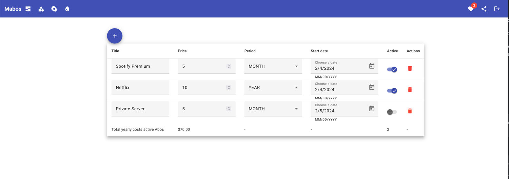

# mabos

<!--- These are examples. See https://shields.io for others or to customize this set of shields. You might want to include dependencies, project status and licence info here --->


<!---->

mabos is a tool to track abo expenses and expirations. To that it servers as a test project to try some architectural concepts.



## Local development

Requirements:
- Java 21
- docker with compose
- Node for Angular 17

Start project - Linux and macOS:
```
0. git clone https://github.com/mab9/mabos.git
1. cd mabos
2. docker compose -f compose-local.yml up -d
3. cd spa && npm run start
4. cd backent && ../mvnw spring-boot:run -Dspring-boot.run.profiles=local
```

### SPA Notes - Frontend

- see package.json scripts.
- icons 4 angular material: https://fonts.google.com/icons


### Some docker commands

build images

    cd backent
    docker build -t mabru/mabos-backent .
    cd spa
    docker build -t mabru/mabos-spa .

### Some keycloak commands

Export keycloak realm - can be imported on keycloak startup

      docker exec -i mabos-keycloak-1 /bin/sh -c '/opt/keycloak/bin/kc.sh export --realm mabos-realm --file /tmp/mabos-realm.json --users realm_file'
      docker cp mabos-keycloak-1:/tmp/mabos-realm.json ./deployment/mabos-realm.json


## Server development

Keycloak is using the Postgres DB in an own schema named keycloak.
Make sure, that the initial DB scripts are executed to be able to start keycloak.
The init scripts are located in the folder db at project root.


1. start postgres, keycloak, backent and frontend with docker compose
2. provide env file with parametrized secrets: .secrets.server.env
3. ensure, that DB was setup correctly.

   docker compose --env-file ./deployment/.secrets.local.env -f compose-server.yml up -d # if you want to test server compose on local env
   docker compose --env-file ./deployment/.secrets.server.env -f compose-server.yml up -d

Side note

    To connect from a container to another container inside the same network:
    - use the service name -> spa, backent, postgres or keycloak
    - use the containers port, not the exposed port on the host system (8080 for keycloak)


## Contributing to mabos
<!--- If your README is long or you have some specific process or steps you want contributors to follow, consider creating a separate CONTRIBUTING.md file--->
To contribute to mabos, follow these steps:

1. Fork this repository.
2. Create a branch: `git checkout -b <branch_name>`.
3. Make your changes and commit them: `git commit -m '<commit_message>'`
4. Push to the original branch: `git push origin mabos/<location>`
5. Create the pull request.

Test your code well, changes to main branche are deployed instantly.

Alternatively see the GitHub documentation on [creating a pull request](https://help.github.com/en/github/collaborating-with-issues-and-pull-requests/creating-a-pull-request).

## My next ideas

- Style frontend 
- Add a PWA
- Write frontend with plain vanilla JS
- Write frontend with bootstrap
- Add extra features to improve ABO tracking - observability.
- Add logging and monitor features
- Provide kubernetes resources for k8s deployment

## Contributors

Thanks to the following people who have contributed to this project:

* [@mab9](https://github.com/mab9) 📖

<!-- You might want to consider using something like the [All Contributors](https://github.com/all-contributors/all-contributors) specification and its [emoji key](https://allcontributors.org/docs/en/emoji-key). -->

## Contact

If you want to contact me you can reach me at **marcantoine.bruelhart@gmail.com.**

## License
<!--- If you're not sure which open license to use see https://choosealicense.com/--->

This project uses the following license: [GNU GPLv3](https://choosealicense.com/licenses/gpl-3.0/).


